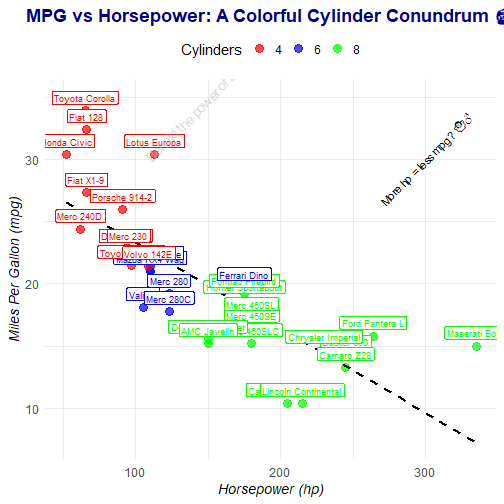

``` r
library(tidyprompt)
```

### Setup an LLM provider

'tidyprompt' can be used with any LLM provider capable of completing a chat.

At the moment, 'tidyprompt' includes pre-built functions to connect with various
LLM providers, such as Ollama, OpenAI, OpenRouter, Mistral, Groq, XAI (Grok), and Google Gemini.

With `llm_provider()`, you can easily write a hook for any other LLM provider.
You could make API calls using the 'httr' package or use another R package that already has
a hook for the LLM provider you want to use. If your API of choice follows the structure
of the OpenAI API, you can call `llm_provider_openai()` and change
the relevant parameters (like the URL and the API key).


``` r
# Ollama running on local PC
ollama <- llm_provider_ollama(
  parameters = list(model = "llama3.1:8b"),
)

# OpenAI API
openai <- llm_provider_openai(
  parameters = list(model = "gpt-4o-mini")
)

# Various providers via OpenRouter (e.g., Anthropic)
openrouter <- llm_provider_openrouter(
  parameters = list(model = "anthropic/claude-3.5-sonnet")
)

# ... functions also included for Mistral, Groq, XAI (Grok), and Google Gemini

# ... or easily create your own hook for any other LLM provider;
#   see ?llm_provider for more information; also take a look at the source code of
#   llm_provider_ollama() and llm_provider_openai(). For APIs that follow the structure
#   of the OpenAI API for chat completion, you can use llm_provider_openai() and change
#   the relevant parameters (like the url and the API key).
```

### Basic prompting

A simple string serves as the base for a prompt.

By adding prompt wraps, you can influence various aspects of how the LLM handles the prompt,
while verifying that the output is structured and valid (including retries with feedback to the LLM if it is not).


``` r
  "Hi there!" |>
    send_prompt(ollama)
#> --- Sending request to LLM provider (llama3.1:8b): ---
#> Hi there!
#> --- Receiving response from LLM provider: ---
#> It's nice to meet you. Is there something I can help you with, or would you like to chat?
#> [1] "It's nice to meet you. Is there something I can help you with, or would you like to chat?"
```
`add_text()` is a simple example of a prompt wrap. It simply adds some text at the end of the base prompt.


``` r
  "Hi there!" |>
    add_text("What is a large language model? Explain in 10 words.") |>
    send_prompt(ollama)
#> --- Sending request to LLM provider (llama3.1:8b): ---
#> Hi there!
#> 
#> What is a large language model? Explain in 10 words.
#> --- Receiving response from LLM provider: ---
#> Sophisticated computer program that processes and generates human-like written language.
#> [1] "Sophisticated computer program that processes and generates human-like written language."
```
You can also construct the final prompt text, without sending it to an LLM provider.


``` r
  "Hi there!" |>
    add_text("What is a large language model? Explain in 10 words.")
#> <tidyprompt>
#> The base prompt is modified by a prompt wrap, resulting in:
#> > Hi there!
#> > 
#> > What is a large language model? Explain in 10 words. 
#> Use '<tidyprompt>$prompt_wraps' to show the prompt wraps.
#> Use '<tidyprompt>$base_prompt' to show the base prompt text.
#> Use '<tidyprompt> |> construct_prompt_text()' to get the full prompt text.
```

### Retrieving output in a specific format

Using prompt wraps, you can force the LLM to return the output in a specific format.
You can also extract the output to turn it from a character into another data type.

For instance, `answer_as_integer()` adds a prompt wrap which forces the LLM
to reply with an integer.

To achieve this, the prompt wrap will add some text to the base prompt, asking
the LLM to reply with an integer. However, the prompt wrap does more: it also
will attempt to extract and validate the integer from the LLM's response. If
extraction or validation fails, feedback is sent back to the LLM, after which
the LLM can retry answering the prompt. Because the extraction function turns the
original character response into a numeric value, the final output from
`send_prompt()` will also be a numeric type.


``` r
  "What is 2 + 2?" |>
    answer_as_integer() |>
    send_prompt(ollama)
#> --- Sending request to LLM provider (llama3.1:8b): ---
#> What is 2 + 2?
#> 
#> You must answer with only an integer (use no other characters).
#> --- Receiving response from LLM provider: ---
#> 4
#> [1] 4
```
Below is an example of a prompt which will initially fail, but will succeed after
`llm_feedback()` and a retry.


``` r
  "What is 2 + 2?" |>
    add_text("Please write out your reply in words, use no numbers.") |>
    answer_as_integer(add_instruction_to_prompt = FALSE) |>
    send_prompt(ollama)
#> --- Sending request to LLM provider (llama3.1:8b): ---
#> What is 2 + 2?
#> 
#> Please write out your reply in words, use no numbers.
#> --- Receiving response from LLM provider: ---
#> Two plus two equals four.
#> --- Sending request to LLM provider (llama3.1:8b): ---
#> You must answer with only an integer (use no other characters).
#> --- Receiving response from LLM provider: ---
#> 4
#> [1] 4
```

### Adding a reasoning mode to the LLM

Prompt wraps may also be used to add a reasoning mode to the LLM. It is hypothesized that this could
improve the LLM's performance on more complex tasks.

For instance, `answer_by_chain_of_thought()` will add chain of thought reasoning mode to the
prompt evaluation by the LLM.
The function wraps the base prompt text within a request for the LLM to reason step by step, asking
it to provide the final answer within 'FINISH[<final answer here>]'. An extraction
function then ensures only the final answer is returned.


``` r
  "What is 2 + 2?" |>
    answer_by_chain_of_thought() |>
    answer_as_integer() |>
    send_prompt(ollama)
#> --- Sending request to LLM provider (llama3.1:8b): ---
#> You are given a user's prompt.
#> To answer the user's prompt, you need to think step by step to arrive at a final answer.
#> 
#> ----- START OF USER'S PROMPT -----
#> What is 2 + 2?
#> 
#> You must answer with only an integer (use no other characters).
#> ----- END OF USER'S PROMPT -----
#> 
#> What are the steps you would take to answer the user's prompt?
#> Describe your thought process in the following format:
#>   >> step 1: <step 1 description>
#>   >> step 2: <step 2 description>
#>   (etc.)
#> 
#> When you are done, you must type:
#>   FINISH[<put here your final answer to the user's prompt>]
#> 
#> Make sure your final answer follows the logical conclusion of your thought process.
#> --- Receiving response from LLM provider: ---
#> >> step 1: Identify that the problem is a basic arithmetic operation involving addition.
#> >> step 2: Recall the specific numbers involved in the operation, which are 2 and 2.
#> >> step 3: Perform the operation by adding the two numbers together to get their sum.
#> 
#> FINISH[4]
#> [1] 4
```

### Giving tools to the LLM (autonomous function-calling)

With `add_tools()`, you can define your own
R functions and give the LLM the ability to call them and process their output.
This enables the LLM to autonomously retrieve additional information or take other actions.


``` r
  # Define a function that returns fake data about the temperature in a location
  temperature_in_location <- function(
    location = c("Amsterdam", "Utrecht", "Enschede"),
    unit = c("Celcius", "Fahrenheit")
  ) {
    location <- match.arg(location)
    unit <- match.arg(unit)

    temperature_celcius <- switch(
      location,
      "Amsterdam" = 32.55,
      "Utrecht" = 19.8,
      "Enschede" = 22.7
    )

    if (unit == "Celcius") {
      return(temperature_celcius)
    } else {
      return(temperature_celcius * 9/5 + 32)
    }
  }

  # Add documentation to the function for the LLM
  temperature_in_location <- add_tools_add_documentation(
    temperature_in_location,
    description = "Get the temperature in a location",
    arguments = list(
      location = "Location, must be one of: 'Amsterdam', 'Utrecht', 'Enschede'",
      unit = "Unit, must be one of: 'Celcius', 'Fahrenheit'"
    ),
    return_value = "The temperature in the specified location and unit"
  )

  # Ask the LLM a question which can be answered with the function
  "Hi, what is the weather temperature in Enschede?" |>
    add_text("I want to know the Celcius degrees.") |>
    answer_as_integer() |>
    add_tools(temperature_in_location) |>
    send_prompt(ollama)
#> --- Sending request to LLM provider (llama3.1:8b): ---
#> Hi, what is the weather temperature in Enschede?
#> 
#> I want to know the Celcius degrees.
#> 
#> You must answer with only an integer (use no other characters).
#> 
#> If you need more information, you can call functions to help you.
#> To call a function, output a JSON object with the following format:
#> 
#> {
#>   "function": "<function name>",
#>   "arguments": {
#>     "<argument_name>": <argument_value>,
#>     ...
#>   }
#> }
#> 
#> (Note: you cannot call other functions within arguments.)
#> 
#> The following functions are available:
#> 
#>   function name: temperature_in_location
#>   description: Get the temperature in a location
#>   arguments:
#>     - location: Location, must be one of: 'Amsterdam', 'Utrecht', 'Enschede'
#>     - unit: Unit, must be one of: 'Celcius', 'Fahrenheit'
#>   return value: The temperature in the specified location and unit
#> 
#> After you call a function, wait until you receive more information.
#> Use the information to decide your next steps or provide a final response.
#> --- Receiving response from LLM provider: ---
#> To get the weather temperature in Enschede, I will call the `temperature_in_location` function with the required arguments.
#> 
#> Here's my first action:
#> 
#> ```
#> {
#>   "function": "temperature_in_location",
#>   "arguments": {
#>     "location": "Enschede",
#>     "unit": "Celcius"
#>   }
#> }
#> ```
#> 
#> Please wait for more information...
#> --- Sending request to LLM provider (llama3.1:8b): ---
#> function called: temperature_in_location
#> arguments used: location = Enschede, unit = Celcius
#> result: 22.7
#> --- Receiving response from LLM provider: ---
#> The current temperature in Enschede is 22.7°C.
#> 
#> So, my response to your original question is:
#> 
#> 22.7
#> --- Sending request to LLM provider (llama3.1:8b): ---
#> You must answer with only an integer (use no other characters).
#> --- Receiving response from LLM provider: ---
#> 22
#> [1] 22
```

`add_tools()` can also be used to give the LLM access to pre-existing functions from packages or base R.
The documentation will then be extracted from the available help file.


``` r
  "What are the files in my current directory?" |>
    add_tools(list.files) |>
    send_prompt(ollama)
#> --- Sending request to LLM provider (llama3.1:8b): ---
#> What are the files in my current directory?
#> 
#> If you need more information, you can call functions to help you.
#> To call a function, output a JSON object with the following format:
#> 
#> {
#>   "function": "<function name>",
#>   "arguments": {
#>     "<argument_name>": <argument_value>,
#>     ...
#>   }
#> }
#> 
#> (Note: you cannot call other functions within arguments.)
#> 
#> The following functions are available:
#> 
#>   function name: list.files
#>   description: List the Files in a Directory/Folder: These functions produce a character vector of the names of files
#> or directories in the named directory.
#>   arguments:
#>     - path: a character vector of full path names; the default corresponds to the working directory, 'getwd()'.  Tilde expansion (see 'path.expand') is performed.  Missing values will be ignored.  Elements with a marked encoding will be converted to the native encoding (and if that fails, considered non-existent).
#>     - pattern: an optional regular expression.  Only file names which match the regular expression will be returned.
#>     - all.files: a logical value.  If 'FALSE', only the names of visible files are returned (following Unix-style visibility, that is files whose name does not start with a dot).  If 'TRUE', all file names will be returned.
#>     - full.names: a logical value.  If 'TRUE', the directory path is prepended to the file names to give a relative file path.  If 'FALSE', the file names (rather than paths) are returned.
#>     - recursive: logical.  Should the listing recurse into directories?
#>     - ignore.case: logical.  Should pattern-matching be case-insensitive?
#>     - include.dirs: logical.  Should subdirectory names be included in recursive listings?  (They always are in non-recursive ones).
#>     - no..: logical.  Should both '"."' and '".."' be excluded also from non-recursive listings?
#>   return value: A character vector containing the names of the files in the
#> specified directories (empty if there were no files).  If a path
#> does not exist or is not a directory or is unreadable it is
#> skipped.
#> The files are sorted in alphabetical order, on the full path if
#> 'full.names = TRUE'.
#> 'list.dirs' implicitly has 'all.files = TRUE', and if 'recursive =
#> TRUE', the answer includes 'path' itself (provided it is a
#> readable directory).
#> 'dir' is an alias for 'list.files'.
#> 
#> After you call a function, wait until you receive more information.
#> Use the information to decide your next steps or provide a final response.
#> --- Receiving response from LLM provider: ---
#> I can call the "list.files" function with the necessary arguments.
#> 
#> Here's my JSON object calling the function:
#> 
#> ```
#> {
#>   "function": "list.files",
#>   "arguments": {
#>     "path": "."
#>   }
#> }
#> ```
#> 
#> Please wait for the output to determine my next steps.
#> --- Sending request to LLM provider (llama3.1:8b): ---
#> function called: list.files
#> arguments used: path = .
#> result: getting_started.Rmd, getting_started.Rmd.orig, precompile vignettes.R
#> --- Receiving response from LLM provider: ---
#> The function has returned a result.
#> 
#> It seems that I have a single file in my current directory (which is represented by the '.' argument), which are:
#> 
#> 1. `getting_started.Rmd`
#> 2. `getting_started.Rmd.orig`
#> 3. `precompile vignettes.R`
#> 
#> Since there are multiple files, and they do not match any specific pattern or condition mentioned in the problem statement, I will conclude that this is indeed the list of files in my current directory.
#> 
#> Therefore, my final response is:
#> 
#> The files in your current directory are: `getting_started.Rmd`, `getting_started.Rmd.orig`, `precompile vignettes.R`.
#> [1] "The function has returned a result.\n\nIt seems that I have a single file in my current directory (which is represented by the '.' argument), which are:\n\n1. `getting_started.Rmd`\n2. `getting_started.Rmd.orig`\n3. `precompile vignettes.R`\n\nSince there are multiple files, and they do not match any specific pattern or condition mentioned in the problem statement, I will conclude that this is indeed the list of files in my current directory.\n\nTherefore, my final response is:\n\nThe files in your current directory are: `getting_started.Rmd`, `getting_started.Rmd.orig`, `precompile vignettes.R`."
```

### Code generation and evaluation

`answer_as_code()` provides a more advanced prompt wrap, which has various options
to enable LLM code generation. R code can be extracted, parsed
for validity, and optionally be evaluated in a dedicated R session (using the
'callr' package). The prompt wrap can also be set to 'tool mode' (with `output_as_tool = TRUE`),
where the output of R code is returned to the LLM, so that it can be used to formulate
a final answer.


``` r
# From prompt to ggplot
plot <- paste0(
  "Create a scatter plot of miles per gallon (mpg) versus",
  " horsepower (hp) for the cars in the mtcars dataset.",
  " Use different colors to represent the number of cylinders (cyl).",
  " Make the plot nice and readable,",
  " but also be creative, a little crazy, and have humour!"
) |>
  answer_as_code(
    pkgs_to_use = c("ggplot2"),
    evaluate_code = TRUE,
    return_mode = "object"
  ) |>
  send_prompt(openai)
plot
```
```{r echo=FALSE, out.width=504}

```


### Creating your own prompt wraps

Using `prompt_wrap()`, you can create your own prompt wraps.
An input for `prompt_wrap()` wrap may be string or a tidyprompt object. If you
pass a string, it will be automatically turned into a tidyprompt object.

Under the hood, a tidyprompt object is just a list with a base prompt (a string) and a series of prompt
wraps. `prompt_wrap()` adds a new prompt wrap to the list of prompt wraps. Each prompt wrap is a list
with a modification function, an extraction function, and/or a validation function (at least
one of these functions must be present). The modification function alters the prompt text,
the extraction function applies a transformation to the LLM's response, and the validation function
checks if the (transformed) LLM's response is valid.

Both extraction and validation functions can return feedback to the LLM, using
`llm_feedback()`. When an extraction or validation function returns this, a
message is sent back to the LLM, and the LLM can retry answering the prompt according
to the feedback. Feedback messages may be a reiteration of instruction or a specific error
message which occured during extraction or validation. When all extractions and validations
have been applied without resulting in feedback, the LLM's response (after transformations
by the extraction functions) will be returned. (`send_prompt()` is responsible
for executing this process.)

Below is a simple example of a prompt wrap, which just adds some text to the base prompt:


``` r
prompt <- "Hi there!" |>
  prompt_wrap(
    modify_fn = function(base_prompt) {
      paste(base_prompt, "How are you?", sep = "\n\n")
    }
  )
```

Shorter notation of the above would be:


``` r
prompt <- "Hi there!" |>
  prompt_wrap(\(x) paste(x, "How are you?", sep = "\n\n"))
```

Often times, it may be preferred to make a function which takes a prompt and
returns a wrapped prompt:


``` r
my_prompt_wrap <- function(prompt) {
  modify_fn <- function(base_prompt) {
    paste(base_prompt, "How are you?", sep = "\n\n")
  }

  prompt_wrap(prompt, modify_fn)
}
prompt <- "Hi there!" |>
  my_prompt_wrap()
```

Take look at the source code of `answer_as_boolean()`, which also uses extraction:


``` r
answer_as_boolean <- function(
    prompt,
    true_definition = NULL,
    false_definition = NULL,
    add_instruction_to_prompt = TRUE
) {
  instruction <- "You must answer with only TRUE or FALSE (use no other characters)."
  if (!is.null(true_definition))
    instruction <- paste(instruction, glue::glue("TRUE means: {true_definition}."))
  if (!is.null(false_definition))
    instruction <- paste(instruction, glue::glue("FALSE means: {false_definition}."))

  modify_fn <- function(original_prompt_text) {
    if (!add_instruction_to_prompt) {
      return(original_prompt_text)
    }

    glue::glue("{original_prompt_text}\n\n{instruction}")
  }

  extraction_fn <- function(x) {
    normalized <- tolower(trimws(x))
    if (normalized %in% c("true", "false")) {
      return(as.logical(normalized))
    }
    return(llm_feedback(instruction))
  }

  prompt_wrap(prompt, modify_fn, extraction_fn)
}
```

Take a look at the source code of, for instance, `answer_as_integer()`, `answer_by_chain_of_thought()`,
and `add_tools()` for more advanced examples of prompt wraps.

#### Breaking out of the evaluation loop

In some cases, you may want to exit the extraction or validation process early. For instance,
your LLM may indicate that it is unable to answer the prompt. In such cases, you can have your
extraction or validation function return `llm_break()`. This will cause the evaluation loop
to break, forwarding to the return statement of `send_prompt()`. See `quit_if()`
for an example of this.

#### Extraction versus validation functions

Both extraction and validation functions can return `llm_break()` or `llm_feedback()`.
The difference between extraction and validation functions is only that an extraction may
transform the LLM response and pass it on to the next extraction and/or validation functions,
while a validation function only checks if the LLM response passes a logical test (without
altering the response). Thus, if you wish, you can perform validations in an
extraction function.

#### Prompt wrap types and order of application

When constructing the prompt text and when evaluating a prompt, prompt wraps are applied
prompt wrap after prompt wrap (e.g., first the extraction and validation functions of
one wrap, then of the other).

The order in which prompt wraps are applied is important. Currently, four types of prompt wraps
are distinguished: 'unspecified', 'break', 'mode', and 'tool'.

When constructing the prompt text,
prompt wraps are applied in the order of these types. Prompt wraps will be automatically reordered if
necesarry (keeping intact the order of prompt wraps of the same type).

When evaluating the prompt,
prompt wraps are applied in the reverse order of types (i.e., first 'tool', then 'mode', then 'break',
and finally 'unspecified'). This is because 'tool' prompt wraps may return a value to be used in
the final answer, 'mode' prompt wraps alter how a LLM forms a final answer,
'break' prompt wraps quit evaluation early based on a specific final answer, and 'unspecified'
prompt wraps are the most general type of prompt wraps which force a final answer
to be in a specific format.
